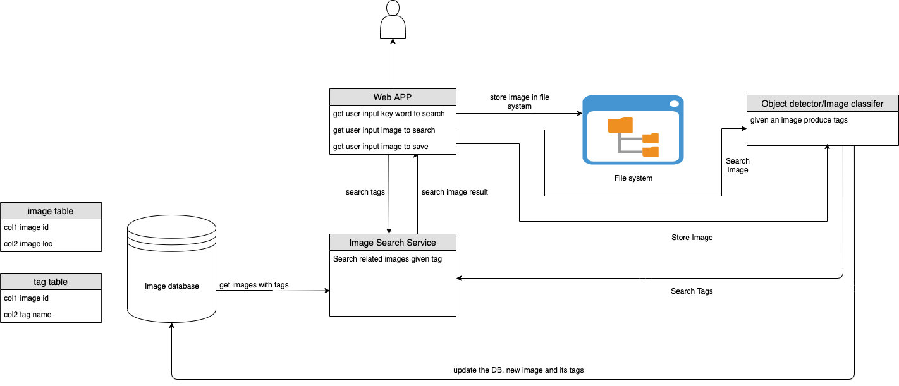

# SmartImageRepository
### prerequisites
1. Docker and docker compose needs to be installed, since everything will be running in docker containers. 
2. Port 8888, 8889, 5432 and 8501 need to be available on the host machine.

### steps to start the app:
 1. Download the state dict of the object detector model of this app from [here](https://drive.google.com/open?id=1UPuvEI1SeugSpjLo5ZZwVqjSuju87pD6), then put it in `TagGeneratorService/model` directory, 
 2. Download the MSCOCO dataset's annotation from [here](https://drive.google.com/open?id=1P__hYzIrKXFiLV1YjZC40CRo28dALc_r), and put it in `data` directory. 
 3. Start the app by running `docker-compose up`, it might take a moment to build.
 4. If this is the first time the app be being built, to populate the database, run the following:
    ```
        docker build -f Dockerfile.populate -t populatedb .
        docker run --network host populatedb
    ```
    fail to do so will result the database being empty. It will take a few minutes to add all entries from MSCOCO dataset's validation set into the database.
 5. Access the app here: http://localhost:8501
 
### how does the app works:
This app is consist of three microservices, search service, tag service and web app.
Postgres database is used for storage, and Redis is used for caching. Everything is containerized and can be bought up
 by running `docker-compose up`. The flow chart of the design can be found below.
 
 
#### ports and endpoints

|services|port|endpoints|
|--------|----|---------|
|web app|8501|None|
|tag service|8888|`/search`|
|search service|8889|`/search`, `/save`|
|postgresSQL DB|5432|None|


 1. The web app 
     
    It accepts user input from the UI, it provides user with three options, search by keywords, search by image, and save image. Then it will
    make the corresponding rest API request to complete the operation.
    
    1. search by keywords, send get request to search service, can be achieved by the following curl command
    
         ``` 
         curl --location --request GET 'http://localhost:8889/search' \
              --header 'Content-Type: application/json' \
              --data-raw '{
                  "tags":["horse","person"]
              }' 
         ```
    
    2. search by image, send post reques to tag service, can be achieved by the following curl command
    
         ```
         curl --location --request POST 'http://localhost:8888/search' \
              --header 'multipart/form-data' \
              --form 'file=@/pathToImage/Image.jpg' 
         ```
         
    3. save image, it will first save the image locally in a docker volume, and them send post request to tag service,
         it can be achieved by the following curl command
    
         ```
         curl --location --request POST 'http://localhost:8888/save' \
             --header 'Content-Type: multipart/form-data' \
             --form 'file=@/pathToImage/flowChart.png' \
             --form 'url=/pathToImage/flowChart.png'
          ```
     
 2. The Tag Service
     
    It has two end points, `/search` and `/save`. The `/search` end point is for search images, it will use the object detector
    to identify what objects are in the image to produce keywords, then it will search those keywords by making `get` request to
    the `/search` end point of the search service and return the response. The `/save` end point is for adding new entries to the DB,
    in the request there will be an image and its url, the detector will produce keywords and the database will be updated.
  
 3. The Search Service
  
    It has one end point, `/search`. It will first clean up the keywords, fix typos and reduce words to base form (Lemmatization), 
    then it will find the top 100 images in DB that contains all keywords in the request, and return their urls. 